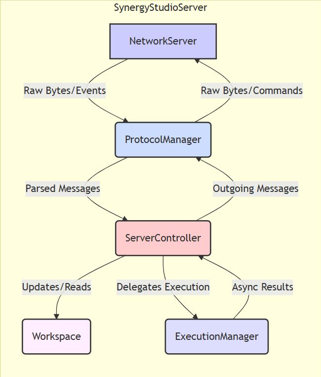
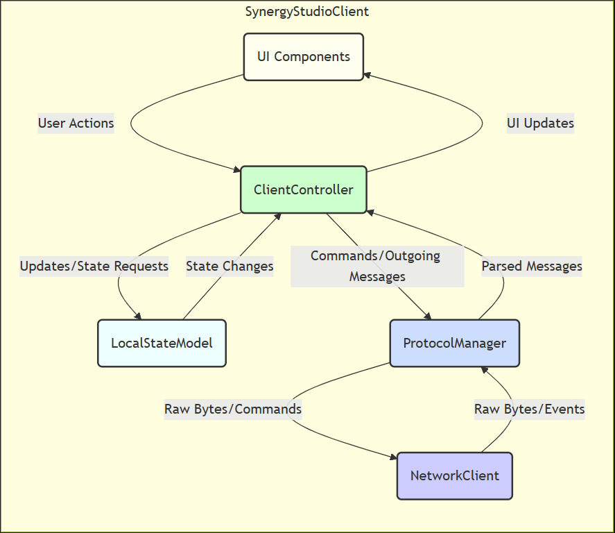

# Synergy Studio - MVP Architecture Plan (Single Text Artifact)

## 1. Overview

This document outlines the architecture for the Minimum Viable Product (MVP) of Synergy Studio. The MVP focuses on real-time, multi-user collaboration on a **single text document**. The server holds the authoritative state, and clients synchronize with it. Drawing features are deferred for this phase. Code execution via Docker is included.

## 2. Core Principles

*   **Separation of Concerns:** Each component has a well-defined responsibility (Network, Protocol, Logic, State, UI).
*   **Server Authority:** The server holds the definitive ("ground truth") version of the shared text document and participant list. Clients reflect the server's state.
*   **Asynchronous Operations:** Network I/O and Docker interactions are non-blocking.
*   **Clear Protocol:** Communication uses a defined JSON message structure over a secure TLS connection with message framing (Length-Prefixing recommended).

## 3. Server Architecture

The server orchestrates connections, manages the session state, and handles execution requests.

### 3.1. Server Component Diagram

### 3.2. Server Components

*   **`NetworkServer`**
    *   **Responsibility:** Manages TCP/TLS connections using `QSslServer`. Handles socket creation, destruction, raw data reading/writing, and basic network errors. Assigns unique `ClientId` to connections.
    *   **State Held:** Map of active connections (`QMap<ClientId, QSslSocket*>`).
    *   **Key Interactions:** Emits `clientConnected(ClientId)`, `clientDisconnected(ClientId)`, `dataReceived(ClientId, QByteArray)`. Has slots `sendMessage(ClientId, QByteArray)`, `broadcastMessage(QList<ClientId>, QByteArray)`, `disconnectClient(ClientId)`.
    *   **Doesn't know about:** JSON, Messages, Sessions, Workspace.

*   **`ProtocolManager` (Server)**
    *   **Responsibility:** Handles message framing (e.g., length-prefixing), serialization (C++ Message Object -> Framed JSON Bytes), and deserialization (Framed JSON Bytes -> C++ Message Object using `MessageFactory`). Manages per-client receive buffers.
    *   **State Held:** Temporary receive buffers per client (`QMap<ClientId, QByteArray>`). Owns `MessageFactory` instance.
    *   **Key Interactions:** Connects to `NetworkServer::dataReceived`. Emits `messageParsed(ClientId, std::unique_ptr<Message_Base>)`. Has slots `sendMessage(ClientId, const Message_Base&)`, `broadcastMessage(QList<ClientId>, const Message_Base&)`. Sends framed bytes via `NetworkServer`.
    *   **Doesn't know about:** Session logic, Workspace content, UI.

*   **`ServerController`**
    *   **Responsibility:** Central logic hub for the single session. Processes parsed messages, manages participants, updates the `Workspace`, handles code execution flow, decides when to broadcast updates.
    *   **State Held:** List of participants (`QMap<ClientId, ParticipantInfo>`). Owns the `Workspace` instance. Owns the `ExecutionManager` instance.
    *   **Key Interactions:** Connects to `ProtocolManager::messageParsed`, `NetworkServer::clientDisconnected`, `ExecutionManager::executionComplete`. Calls `Workspace` methods (`setText`, `getText`). Calls `ExecutionManager::executeCode`. Calls `ProtocolManager` to send/broadcast specific messages (`session_state`, `text_update`, `participant_update`, `execution_result`, `error`).
    *   **Doesn't know about:** Raw network bytes, sockets, message framing, UI.

*   **`Workspace`**
    *   **Responsibility:** Pure data container for the single session's shared state.
    *   **State Held:** The authoritative text document (`QString m_text`). (Drawing state deferred).
    *   **Key Interactions:** Provides methods like `setText(QString)`, `getText()`. Called only by `ServerController`.
    *   **Doesn't know about:** Network, Protocol, Participants, Execution.

*   **`ExecutionManager`**
    *   **Responsibility:** Manages interaction with the Docker Engine API asynchronously to execute code snippets securely in containers.
    *   **State Held:** Internal tracking of ongoing Docker requests.
    *   **Key Interactions:** Has slot `executeCode(ClientId, qint64 seqId, QString lang, QString code)`. Emits `executionComplete(ClientId, qint64 seqId, ExecutionResult result)` upon completion/error. Communicates only with `ServerController` (for requests/results) and Docker Engine API.
    *   **Doesn't know about:** Session state, Participants, Workspace text, general Protocol messages.

## 4. Client Architecture

The client connects to the server, reflects the shared state, sends user actions, and displays information.

### 4.1. Client Component Diagram

### 4.2. Client Components

*   **`NetworkClient`**
    *   **Responsibility:** Manages the single `QSslSocket` connection to the server. Handles connecting, disconnecting, raw data reading/writing, TLS handshake, basic network errors.
    *   **State Held:** The `QSslSocket` object, connection status.
    *   **Key Interactions:** Emits `connected()`, `disconnected()`, `dataReceived(QByteArray)`, `errorOccurred(...)`. Has slots `connectToServer(host, port)`, `disconnectFromServer()`, `sendMessage(QByteArray)`.
    *   **Doesn't know about:** JSON, Messages, Application Logic, UI.

*   **`ProtocolManager` (Client)**
    *   **Responsibility:** Handles message framing, serialization (outgoing), and deserialization (incoming using `MessageFactory`). Manages receive buffer.
    *   **State Held:** Receive buffer (`QByteArray`). Owns `MessageFactory` instance.
    *   **Key Interactions:** Connects to `NetworkClient::dataReceived`. Emits `messageParsed(std::unique_ptr<Message_Base>)`. Has slot `sendMessage(const Message_Base&)`. Sends framed bytes via `NetworkClient`.
    *   **Doesn't know about:** Application logic, UI state, specific UI widgets.

*   **`ClientController`**
    *   **Responsibility:** Central application logic. Processes messages from the server (`session_state`, `text_update`, `participant_update`, `execution_result`, `error`). Handles user actions initiated from the UI (typing, execute button). Updates the `LocalStateModel`. Constructs outgoing messages and sends them via `ProtocolManager`. Bridges between UI and the rest of the application.
    *   **State Held:** Connection status awareness.
    *   **Key Interactions:** Connects to `ProtocolManager::messageParsed`. Connects to UI signals (e.g., `executeClicked`, `textModified`). Calls `LocalStateModel` setters. Calls `ProtocolManager::sendMessage`. Emits signals to update UI (e.g., `updateUiText`, `updateParticipantsList`, `displayExecutionResult`, `showError`).
    *   **Doesn't know about:** Raw network bytes, sockets, message framing, specific widget implementation details.

*   **`LocalStateModel`**
    *   **Responsibility:** Holds the client's local copy of the shared session state.
    *   **State Held:** Current text (`QString m_text`), list of participants (`QList<ParticipantInfo>`).
    *   **Key Interactions:** Provides getters (`getText`, `getParticipants`). Has setters (`setText`, `updateParticipants`) called by `ClientController`. May emit signals (`textChanged`, `participantsChanged`) if needed for complex UI updates.
    *   **Doesn't know about:** Network, Protocol, UI widgets.

*   **`UI Components`** (e.g., `MainWindow`, `TextEditorWidget`, `ParticipantListWidget`, `ExecutionOutputWidget`)
    *   **Responsibility:** Display data from `ClientController` / `LocalStateModel`. Capture user input (typing, button clicks) and emit signals representing those actions.
    *   **State Held:** Widget-specific state (e.g., cursor position, scroll position).
    *   **Key Interactions:** Connects to `ClientController` signals for updates. Emits signals for user actions (e.g., `textModifiedByUser(QString)`, `executeClicked(QString lang, QString code)`), which are connected to `ClientController` slots.
    *   **Doesn't know about:** Network, Protocol, `LocalStateModel` internals (ideally interacts only via `ClientController`).

## 5. Communication Protocol Summary (MVP)

*   **Transport:** JSON objects serialized to UTF-8 `QByteArray`.
*   **Framing:** Length-Prefix recommended (e.g., `quint32` size followed by JSON bytes).
*   **Security:** Mandatory TLS via `QSslServer` / `QSslSocket`.
*   **Key Messages:**
    *   C->S: `join_session` (username)
    *   S->C: `session_state` (full text, participant list) - Sent on join.
    *   C->S: `text_edit` (full text)
    *   S->C: `text_update` (full text, source client ID) - Broadcast on change.
    *   C->S: `execute_code` (lang, code, seq_id)
    *   S->C: `execution_result` (stdout, stderr, exit_code, seq_id) - Sent to requester.
    *   S->C: `participant_update` (action="joined"/"left", participant info) - Broadcast.
    *   S->C: `error` (error code, message) - Sent to specific client usually.
    *   C->S: `leave_session` (Optional, disconnection is implicit)

## 7. Next Steps & Implementation Order

1.  **Protocol Library:** Finalize the `Message_Base` hierarchy, `MessageFactory`, and concrete message classes for the MVP scope in a separate library/module.
2.  **Server Core:** Implement `NetworkServer`, `ProtocolManager (Server)`, `ServerController`, and `Workspace` (with simple `QString`). Focus on handling `join`, `text_edit`, basic participant management, and broadcasting `session_state`, `text_update`, `participant_update`.
3.  **Client Core:** Implement `NetworkClient`, `ProtocolManager (Client)`, `ClientController`, and `LocalStateModel`. Focus on connecting, sending `join`/`text_edit`, and receiving/displaying `session_state`/`text_update`/`participant_update`.
4.  **Basic UI:** Create minimal client UI widgets to display text, participant list, and allow typing. Hook them up to `ClientController`.
5.  **Execution:** Implement `ExecutionManager` on the server and the `execute_code`/`execution_result` flow, including UI elements on the client.
6.  **Refinement:** Add error handling, logging, testing, and address security details (input validation, etc.).
