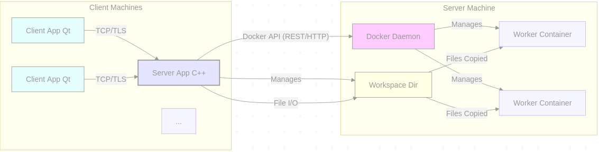

# **Synergy Studio - Software Specification Document**

**Version:** 1.0 Draft A
**Date:** April 11, 2025
**Status:** Draft

## **Table of Contents**

1.  Introduction
  -  1.1. Purpose
  -  1.2. Document Conventions
  -  1.3. Intended Audience
  -  1.4. Scope
  -  1.5. Definitions, Acronyms, and Abbreviations
  -  1.6. References
2.  Overall Description
  -  2.1. Product Perspective
  -  2.2. Product Features
  -  2.3. User Characteristics
  -  2.4. Constraints
  -  2.5. Assumptions and Dependencies
3.  System Architecture
  -  3.1. Architectural Overview
  -  3.2. Technology Stack
4.  Specific Requirements
  -  4.1. Server Functional Requirements (SynergyStudioServer)
  -  4.2. Client Functional Requirements (SynergyStudioClient)
5.  Communication Protocol Specification
  -  5.1. Overview
  -  5.2. Transport and Framing
  -  5.3. Data Format and Conventions
  -  5.4. Message Types: Client to Server (C->S)
  -  5.5. Message Types: Server to Client (S->C)
6.  Non-Functional Requirements
  -  6.1. Performance Requirements (NFR-PERF)
  - 6.2. Security Requirements (NFR-SEC)
  -  6.3. Reliability Requirements (NFR-REL)
  -  6.4. Usability Requirements (NFR-USE)
  -  6.5. Maintainability Requirements (NFR-MAINT)
  -  6.6. Portability Requirements (NFR-PORT)
7.  Interface Requirements
  -  7.1. User Interfaces (UI)
  -  7.2. Hardware Interfaces
  -  7.3. Software Interfaces
  -  7.4. Communications Interfaces
8.  Licensing Requirements
9.  Documentation Requirements
  -  9.1. User Documentation (Placeholder)
  -  9.2. Developer Documentation (Placeholder)
  -  9.3. README File
10. Appendices
  -  Appendix A: Glossary (Placeholder)
  -  Appendix B: Analysis Models (Placeholder)
11. Internal Design Considerations
  -  11.1. Key Class Structures (Conceptual)
  -  11.2. Synchronization Algorithm (MVP Approach)
  -  11.3. Threading Model
  -  11.4. Error Handling Strategy
12. Security Threat Model (STRIDE Analysis)
  -  12.1. Spoofing
  -  12.2. Tampering
  -  12.3. Repudiation
  -  12.4. Information Disclosure
  -  12.5. Denial of Service (DoS)
  -  12.6. Elevation of Privilege
13. Data Dictionary

---

## **1. Introduction**

**1.1. Purpose**

This document specifies the requirements and design intentions for the initial Minimum Viable Product (MVP) release of the Synergy Studio software system. Synergy Studio is envisioned as a desktop application designed to facilitate real-time, multi-user collaboration on software development artifacts. Its core capabilities encompass synchronized text editing, synchronized visual sketching overlaid onto the text context, and the secure execution of code within containerized environments orchestrated via the Docker Engine API. This specification serves as the primary reference for development, testing, and evaluation of the Synergy Studio MVP.

**1.2. Document Conventions**

The key words "MUST", "MUST NOT", "REQUIRED", "SHALL", "SHALL NOT", "SHOULD", "SHOULD NOT", "RECOMMENDED", "MAY", and "OPTIONAL" in this document are to be interpreted as described in RFC 2119. For the purpose of this MVP specification, most requirements will utilize "SHALL" to denote mandatory functionality. Requirements are identified using a hierarchical numbering scheme for traceability.

**1.3. Intended Audience**

This document is intended for software developers involved in the design, implementation, and testing of Synergy Studio, as well as project managers overseeing its development. It assumes a reader familiar with software development concepts, client-server architectures, network protocols, containerization (specifically Docker), and the Qt framework.

**1.4. Scope**

The scope of this specification is limited to the Minimum Viable Product (MVP) version of Synergy Studio. The MVP SHALL provide the core functionalities of:

*   Establishing secure client-server connections.
*   Managing collaborative sessions with multiple users.
*   Managing a shared workspace represented as a directory structure, with the constraint that only a single file within the workspace is actively editable by all participants simultaneously.
*   Synchronizing text edits for the active file in near real-time.
*   Synchronizing simple freehand drawing actions on a transparent canvas overlaid on the active editor.
*   Initiating build or execution commands (e.g., `make`, `python script.py`) within the context of the shared workspace, executed securely inside ephemeral Docker containers managed by the server component.
*   Displaying the results (standard output, standard error, exit code) of the execution back to all participants in the session.

Features explicitly out of scope for this MVP specification include, but are not limited to: peer-to-peer architecture, advanced synchronization algorithms (OT/CRDT), simultaneous multi-file editing, persistent user accounts or complex authentication, advanced drawing tools, version control integration, and web-based interfaces. These may be considered for future revisions.

**1.5. Definitions, Acronyms, and Abbreviations**

*   **API:** Application Programming Interface
*   **Client:** The Synergy Studio desktop application (`SynergyStudioClient`) running on an end-user's machine.
*   **Server:** The Synergy Studio backend application (`SynergyStudioServer`) responsible for managing sessions, state, and execution.
*   **Session:** A single instance of a collaborative workspace involving one or more connected Clients managed by the Server.
*   **Workspace:** The set of files and directories associated with a Session, managed by the Server on its filesystem.
*   **Active File:** The single file within the Workspace that is currently open for viewing and editing by all participants in a Session.
*   **Canvas:** The transparent drawing surface overlaid on the text editor view, synchronized across Clients in a Session.
*   **Docker Engine API:** The REST API provided by the Docker daemon for managing containers, images, volumes, etc.
*   **Worker Container:** An ephemeral Docker container, launched by the Server via the Docker Engine API, used to execute code originating from the Workspace.
*   **GUI:** Graphical User Interface
*   **IDE:** Integrated Development Environment
*   **JSON:** JavaScript Object Notation
*   **MVP:** Minimum Viable Product
*   **SRS:** Software Requirements Specification
*   **TCP:** Transmission Control Protocol
*   **TLS:** Transport Layer Security
*   **UI:** User Interface
*   **UX:** User Experience

**1.6. References**

*   RFC 2119: Key words for use in RFCs to Indicate Requirement Levels
*   Qt 6 Documentation (<https://doc.qt.io/>)
*   Docker Engine API Documentation (<https://docs.docker.com/engine/api/>)
*   CMake Documentation (<https://cmake.org/documentation/>)
*   Git Documentation (<https://git-scm.com/doc>)

---

## **2. Overall Description**

**2.1. Product Perspective**

Synergy Studio is a self-contained software system comprising two main components: a server application (`SynergyStudioServer`) and a client application (`SynergyStudioClient`). It operates on a client-server model over a TCP/IP network, secured using TLS. The system is intended to run on standard desktop operating systems (Linux, Windows initially). The Server component relies on the presence of a functional Docker Engine installation on the same host machine to provide its code execution capabilities. It does not directly integrate with other version control systems or external IDEs in its MVP form, but provides a platform for collaborative coding and execution.

**2.2. Product Features**

The Synergy Studio MVP SHALL provide the following primary features:

*   **Secure Session Management:** Establishment of secure, TLS-encrypted connections between clients and the server. Management of distinct collaborative sessions, allowing multiple users to join a shared workspace context.
*   **Workspace Synchronization ("Workspace Lite"):** Presentation of a shared workspace's file structure to all clients within a session. Enforcement of a single "active file" model, where only one selected file is concurrently editable and viewable by all participants.
*   **Real-time Text Collaboration:** Synchronization of text content modifications made to the active file across all clients in the session in near real-time.
*   **Real-time Visual Collaboration:** Synchronization of simple freehand drawing actions performed on a transparent canvas overlay across all clients in the session in near real-time.
*   **Sandboxed Code Execution:** Ability for any client in the session to trigger the execution of commands (e.g., build scripts, interpreter commands) within the context of the shared workspace. Execution SHALL occur within isolated Docker containers managed by the Server component via the Docker Engine API.
*   **Execution Result Display:** Aggregation and display of standard output, standard error, and exit status from the containerized code execution back to all participating clients.

**2.3. User Characteristics**

The intended users are software developers, students, or individuals involved in collaborative technical work who possess:

*   Familiarity with common desktop application usage patterns.
*   Understanding of basic programming concepts, file systems, and command-line execution.
*   Access to a compatible operating system (Linux, Windows for MVP).
*   Ability to install and run the Synergy Studio Client application.
*   (For the user hosting the Server) Ability to install and run the Synergy Studio Server application and have Docker Engine installed and running on the same machine.

**2.4. Constraints**

*   **CS-CON-01:** The system SHALL employ a Client-Server architecture.
*   **CS-CON-02:** Communication between Client and Server SHALL be secured using TLS over TCP/IP.
*   **CS-CON-03:** The Server component SHALL require a functional Docker Engine installation on its host machine to provide code execution features. Interaction SHALL occur via the Docker Engine REST API.
*   **CS-CON-04:** The Client and Server applications SHALL be developed using C++ (targeting C++17 or C++20 standard).
*   **CS-CON-05:** The Qt 6 framework SHALL be used for GUI development, networking, and other core functionalities where applicable.
*   **CS-CON-06:** CMake SHALL be used as the build system generator.
*   **CS-CON-07:** Git SHALL be used for version control during development.
*   **CS-CON-08:** The MVP targets Linux (specific distribution TBD, e.g., Ubuntu LTS) and Windows (10/11) platforms.
*   **CS-CON-09:** Text synchronization for the MVP will utilize a simplified mechanism (e.g., server broadcasts full content on change) and does not guarantee perfect handling of simultaneous conflicting edits.
*   **CS-CON-10:** Drawing synchronization supports basic freehand lines; complex shapes or features are out of scope for MVP.

**2.5. Assumptions and Dependencies**

*   **CS-DEP-01:** Users have reliable network connectivity between the Client machines and the Server machine.
*   **CS-DEP-02:** The machine hosting the Server application has sufficient resources (CPU, RAM, Disk I/O) to manage active sessions, file operations, and Docker container execution.
*   **CS-DEP-03:** The Docker Engine is correctly installed and operational on the Server host, and the Server application has the necessary permissions to interact with the Docker Engine API (e.g., access to the Docker socket or TCP port).
*   **CS-DEP-04:** Pre-built Docker images containing necessary execution tools (e.g., GCC, Make, Python) are available to the Docker Engine on the Server host.
*   **CS-DEP-05:** Users can manage the distribution and setup of TLS certificates required for secure communication (e.g., generating self-signed certificates for testing).

---

## **3. System Architecture**

**3.1. Architectural Overview**

The Synergy Studio system adheres to a client-server architectural pattern. Multiple `SynergyStudioClient` instances connect over a network to a single `SynergyStudioServer` instance.

*   The **`SynergyStudioServer`** acts as the central orchestrator. It manages client connections, authenticates sessions (through simple mechanisms in MVP), maintains the authoritative state for each session's Workspace (stored on the server's local filesystem within designated directories), processes and broadcasts synchronization messages for text and drawing edits related to the single active file/canvas, and interfaces with the local Docker Engine via its REST API to fulfill code execution requests.
*   The **`SynergyStudioClient`** provides the user interface. It establishes a secure connection to the Server, sends user actions (file selection, text edits, drawing strokes, execution requests) as protocol messages, receives state updates (file content, directory structures, drawing commands, execution results) from the Server, and renders this information to the user via its Qt-based GUI components. The Client maintains a local cache of the state relevant to its current view but relies on the Server as the ultimate source of truth.
*   The **Docker Engine** runs as a separate daemon process on the Server host. It exposes a REST API, typically via a Unix socket or a TCP port. The `SynergyStudioServer` interacts with this API to create, manage, and execute commands within isolated Worker Containers. The containers are generally ephemeral, created for a specific execution task and subsequently removed.
*   The **Workspace Directory** resides on the Server host's filesystem. The Server performs standard file I/O operations within these directories to manage the session's code and artifacts. Data is copied from the Workspace Directory into Worker Containers before execution.



**3.2. Technology Stack**

The technologies mandated for the development and operation of Synergy Studio MVP are:

*   **Primary Language:** C++ (Standard C++17 or C++20)
*   **Core Framework:** Qt 6 (Modules anticipated: Core, GUI, Widgets, Network, Test)
*   **Build System:** CMake (Version 3.15 or higher recommended)
*   **Network Protocol:** Custom JSON-based messaging over TCP/IP, secured with TLS 1.2 or higher.
*   **Containerization Interface:** Docker Engine REST API (Version corresponding to Docker Engine 20.10 or later recommended).
*   **Runtime Dependency (Server):** Docker Engine installation.
*   **Version Control:** Git

---

## **4. Specific Requirements**

**4.1. Server Functional Requirements (SynergyStudioServer)**

This subsection outlines the mandatory functional capabilities of the `SynergyStudioServer` application.

**4.1.1. Network Management (SRV-FUNC-NM)**

*   **SRV-FUNC-NM-001:** The Server SHALL listen for incoming TCP connections on a network interface and port specified via configuration.
*   **SRV-FUNC-NM-002:** Upon accepting an incoming TCP connection, the Server SHALL initiate a TLS handshake to establish a secure communication channel.
*   **SRV-FUNC-NM-003:** The Server SHALL require a valid, configured server-side TLS certificate and corresponding private key to successfully complete the TLS handshake.
*   **SRV-FUNC-NM-004:** The Server SHALL reject connections that fail to establish a valid TLS session.
*   **SRV-FUNC-NM-005:** The Server SHALL be capable of handling multiple concurrent client connections, limited only by available system resources and potentially configurable limits.
*   **SRV-FUNC-NM-006:** The Server SHALL associate each active, authenticated client connection with a specific collaborative Session.
*   **SRV-FUNC-NM-007:** The Server SHALL detect client disconnections (both graceful and abrupt) and initiate appropriate cleanup procedures for the associated client state within its Session.
*   **SRV-FUNC-NM-008:** The Server SHALL implement message framing for the TLS stream. Each logical message payload (JSON object) SHALL be preceded by a 4-byte unsigned integer in network byte order (big-endian), indicating the exact byte length of the following JSON payload.
*   **SRV-FUNC-NM-009:** The Server SHALL parse incoming framed data into discrete JSON messages based on the length prefix. Malformed framing or invalid JSON SHALL result in logging an error and potentially terminating the offending client connection.

**4.1.2. Session Management (SRV-FUNC-SM)**

*   **SRV-FUNC-SM-001:** The Server SHALL provide a mechanism for a client to request the creation of a new collaborative Session.
*   **SRV-FUNC-SM-002:** Upon successful Session creation, the Server SHALL generate a unique Session Identifier (Session ID).
*   **SRV-FUNC-SM-003:** The Server SHALL associate a newly created Session with a dedicated Workspace directory on the server's filesystem (see SRV-FUNC-WM).
*   **SRV-FUNC-SM-004:** The Server SHALL return the generated Session ID to the client that requested Session creation via a `SessionCreatedResponse` message.
*   **SRV-FUNC-SM-005:** The Server SHALL provide a mechanism for a client to request joining an existing Session using a Session ID.
*   **SRV-FUNC-SM-006:** The Server MAY support optional password protection for Sessions, configurable at creation time. If a password is set, the `JoinSessionRequest` SHALL include the password, and the Server SHALL validate it before allowing the client to join.
*   **SRV-FUNC-SM-007:** Upon successful joining of a Session, the Server SHALL add the client to the list of participants for that Session and send a `JoinSessionResponse` indicating success.
*   **SRV-FUNC-SM-008:** If a client attempts to join a non-existent Session or provides an incorrect password, the Server SHALL send a `JoinSessionResponse` indicating failure with an appropriate error message.
*   **SRV-FUNC-SM-009:** The Server SHALL maintain, for each active Session, a record of all currently connected participating clients.
*   **SRV-FUNC-SM-010:** When a client joins a Session, the Server SHALL notify all other participants in that Session via a `UserJoined` message.
*   **SRV-FUNC-SM-011:** When a client leaves or disconnects from a Session, the Server SHALL notify all remaining participants in that Session via a `UserLeft` message.
*   **SRV-FUNC-SM-012:** Each Session SHALL maintain state including the path to its associated Workspace directory, the relative path of the currently Active File (if any), and the current state of the collaborative drawing Canvas.

**4.1.3. Workspace Management (SRV-FUNC-WM)**

*   **SRV-FUNC-WM-001:** The Server SHALL utilize a base directory specified in its configuration for storing all Session Workspaces.
*   **SRV-FUNC-WM-002:** Upon creation of a new Session, the Server SHALL create a unique subdirectory within the base workspace directory to serve as the root for that Session's Workspace. The naming convention SHOULD incorporate the Session ID or a derivative thereof.
*   **SRV-FUNC-WM-003:** The Server SHALL, upon client request (`RequestFileTree`), recursively scan the Session's Workspace directory and generate a hierarchical representation of its contents (files and subdirectories).
*   **SRV-FUNC-WM-004:** The Server SHALL transmit the generated workspace structure to the requesting client using a `FileTreeUpdate` message, formatted as specified (e.g., nested JSON objects).
*   **SRV-FUNC-WM-005:** The Server SHALL process `RequestOpenFile` messages from clients. The request SHALL contain a file path relative to the Workspace root.
*   **SRV-FUNC-WM-006:** Before processing any file access request (`RequestOpenFile`, `UpdateTextEdit`), the Server SHALL rigorously validate the provided file path. Validation SHALL ensure the path is relative, resolves strictly within the bounds of the Session's designated Workspace directory, and does not contain elements intended for directory traversal (e.g., `..`, absolute paths, disallowed symlinks). Invalid paths SHALL result in an error response or rejection of the request.
*   **SRV-FUNC-WM-007:** Upon receiving a valid `RequestOpenFile` request, the Server SHALL read the content of the specified file from the Workspace directory.
*   **SRV-FUNC-WM-008:** The Server SHALL designate the successfully opened file as the new Active File for the Session, updating the Session's state.
*   **SRV-FUNC-WM-009:** The Server SHALL send the content of the newly Active File to all participants in the Session via a `SetActiveFile` message.
*   **SRV-FUNC-WM-010:** The Server SHALL process `UpdateTextEdit` messages pertaining to the currently Active File.
*   **SRV-FUNC-WM-011:** Upon receiving a valid `UpdateTextEdit` message, the Server SHALL update its authoritative buffer for the Active File content.
*   **SRV-FUNC-WM-012:** The Server SHALL persist the updated content of the Active File to the corresponding file within the Workspace directory (e.g., on receipt of update, or triggered by an implicit save action like closing the file). The exact save strategy MAY be refined.
*   **SRV-FUNC-WM-013:** The MVP Server MAY support `CreateFile` requests. If supported, the Server SHALL validate the path, create an empty file (or with provided initial content) within the Workspace, and potentially notify clients via an updated `FileTreeUpdate`.
*   **SRV-FUNC-WM-014:** The MVP Server is NOT REQUIRED to handle file deletion or renaming requests in real-time, nor provide real-time `FileTreeUpdate` broadcasts on external file system changes.

**4.1.4. Synchronization Management (SRV-FUNC-SYNC)**

*   **SRV-FUNC-SYNC-001:** The Server SHALL act as the central mediator for all real-time synchronization updates within a Session.
*   **SRV-FUNC-SYNC-002:** Upon receiving a validated `UpdateTextEdit` message from a client for the Active File, the Server SHALL broadcast this update to all *other* participants currently connected to the same Session. The broadcast message SHALL be `UpdateTextEdit` (containing the full updated content for MVP).
*   **SRV-FUNC-SYNC-003:** The Server SHALL process `DrawCommand` messages (e.g., for drawing lines) received from a client.
*   **SRV-FUNC-SYNC-004:** Upon receiving a validated `DrawCommand`, the Server SHALL broadcast this command message to all *other* participants currently connected to the same Session.
*   **SRV-FUNC-SYNC-005:** The Server MAY store the sequence of validated `DrawCommand`s for the Session to replay to newly joining clients, or alternatively, MAY require new clients to start with a blank Canvas. The specification RECOMMENDS the latter for MVP simplicity.
*   **SRV-FUNC-SYNC-006:** The Server SHALL process `ClearCanvasRequest` messages. Upon receipt, it SHALL clear its internal representation of the canvas state (if any) and broadcast a `ClearCanvasBroadcast` message to all participants in the Session.
*   **SRV-FUNC-SYNC-007:** The MVP Server synchronization mechanisms do not guarantee consistency under high rates of conflicting concurrent edits or drawing actions. Simple last-write-wins or server-serialized processing is acceptable.

**4.1.5. Docker Execution Management (SRV-FUNC-DOCKER)**

*   **SRV-FUNC-DOCKER-001:** The Server SHALL process `RequestRunCode` messages received from clients within a Session.
*   **SRV-FUNC-DOCKER-002:** The Server SHALL interact with the Docker Engine via its configured REST API endpoint (Unix socket or TCP). All interactions SHALL be non-blocking where feasible to avoid stalling the main server loop.
*   **SRV-FUNC-DOCKER-003:** The Server SHALL identify or select an appropriate pre-built Docker image tag (e.g., `synergy-worker:latest`, `synergy-worker:python`) based on configuration or potentially the run request context (deferred feature). For MVP, a single default worker image SHALL be used.
*   **SRV-FUNC-DOCKER-004:** For each `RequestRunCode`, the Server SHALL orchestrate the following sequence using the Docker Engine API:
    1.  **Container Creation:** Create a new container instance from the selected image (`POST /containers/create`). Configuration MAY include options for automatic removal (`HostConfig.AutoRemove`).
    2.  **Workspace Injection:** Archive the current state of the Session's Workspace directory (or a relevant subset) into a TAR stream and upload it to the container using the `PUT /containers/{id}/archive` API endpoint, placing it at a predefined location (e.g., `/workspace`) inside the container. **Crucial:** Tar the directory content first for the API.
    3.  **Execution Setup:** Create an execution instance within the running container using `POST /containers/{id}/exec`, specifying the command requested by the client (e.g., `make`, `python`), its arguments, the working directory (e.g., `/workspace`), and requesting attachment to stdout/stderr (`AttachStdout: true`, `AttachStderr: true`).
    4.  **Execution Start & Output Streaming:** Start the execution instance using `POST /exec/{exec_id}/start` with appropriate options (`detach: false`, `tty: false`). The Server SHALL attach to the multiplexed output stream provided by the API to capture stdout and stderr.
    5.  **Await Completion:** Monitor the execution instance until it terminates.
    6.  **Retrieve Status:** Inspect the execution instance (`GET /exec/{exec_id}/json`) to retrieve the final exit code.
    7.  **Container Cleanup:** Ensure the container is stopped and/or removed (implicitly via `AutoRemove` or explicitly via `POST /containers/{id}/stop` then `DELETE /containers/{id}`).
*   **SRV-FUNC-DOCKER-005:** The Server SHALL aggregate the captured standard output, standard error, and the final exit code from the container execution.
*   **SRV-FUNC-DOCKER-006:** The Server SHALL send the aggregated results to all participants in the Session using a `RunOutputResult` message.
*   **SRV-FUNC-DOCKER-007:** The Server SHALL handle potential errors during any stage of the Docker interaction (API connection errors, image not found, container creation failure, execution errors within the container, cleanup failures) by logging the error and potentially sending an `ErrorNotification` message back to the requesting client or all clients in the session.

**4.1.6. Protocol Handling (SRV-FUNC-PROTO)**

*   **SRV-FUNC-PROTO-001:** The Server SHALL correctly parse all defined incoming message types from the Client (as specified in Section 5).
*   **SRV-FUNC-PROTO-002:** The Server SHALL validate the structure and data types of fields within received JSON messages. Invalid messages SHALL be logged and potentially lead to client disconnection.
*   **SRV-FUNC-PROTO-003:** The Server SHALL generate correctly formatted outgoing messages (as specified in Section 5) for broadcasting or responding to clients.
*   **SRV-FUNC-PROTO-004:** All string data within JSON payloads SHALL use UTF-8 encoding.

**4.1.7. Security Requirements (SRV-FUNC-SEC)**

*   **SRV-FUNC-SEC-001:** The Server SHALL enforce TLS encryption for all client connections (Reference SRV-FUNC-NM-002). Unencrypted connections SHALL NOT be permitted.
*   **SRV-FUNC-SEC-002:** The Server SHALL perform rigorous path validation for all file operations requested by clients to strictly contain access within the designated session Workspace directory (Reference SRV-FUNC-WM-006).
*   **SRV-FUNC-SEC-003:** The Server SHALL NOT execute code received from clients directly on the server host. All code execution SHALL be delegated to isolated Docker containers (Reference SRV-FUNC-DOCKER).
*   **SRV-FUNC-SEC-004:** The Server SHOULD sanitize or validate commands and arguments passed to `docker exec` to prevent potential command injection vulnerabilities targeting the container environment itself, although the container provides the primary isolation boundary.

**4.1.8. Configuration (SRV-FUNC-CONF)**

*   **SRV-FUNC-CONF-001:** The Server's operational parameters SHALL be configurable. This SHOULD be achievable via command-line arguments or a configuration file (e.g., INI or JSON format).
*   **SRV-FUNC-CONF-002:** Configurable parameters SHALL include: network listen address/port, path to the TLS certificate file, path to the TLS private key file, path to the base directory for session workspaces, Docker Engine API endpoint (if non-standard), default Docker worker image tag, and logging verbosity level.

**4.2. Client Functional Requirements (SynergyStudioClient)**

This subsection outlines the mandatory functional capabilities of the `SynergyStudioClient` application.

**4.2.1. Network Management (CLI-FUNC-NM)**

*   **CLI-FUNC-NM-001:** The Client SHALL provide a mechanism for the user to specify the network address (hostname or IP) and port of the `SynergyStudioServer`.
*   **CLI-FUNC-NM-002:** The Client SHALL initiate a TCP connection to the specified Server address and port.
*   **CLI-FUNC-NM-003:** Upon establishing a TCP connection, the Client SHALL initiate a TLS handshake to establish a secure communication channel using `QSslSocket`.
*   **CLI-FUNC-NM-004:** The Client SHALL handle TLS server certificate validation. For development/testing, it MAY allow acceptance of self-signed or untrusted certificates via user confirmation or configuration, but production use SHOULD encourage proper certificate validation.
*   **CLI-FUNC-NM-005:** The Client SHALL gracefully handle connection failures (e.g., server unreachable, TLS handshake failure) and provide appropriate feedback to the user (e.g., status message, dialog box).
*   **CLI-FUNC-NM-006:** The Client SHALL maintain the active connection state and detect server disconnections (graceful or abrupt).
*   **CLI-FUNC-NM-007:** Upon disconnection, the Client SHALL update its UI state to reflect the disconnected status and potentially offer a reconnection mechanism.
*   **CLI-FUNC-NM-008:** The Client SHALL implement message framing for the TLS stream, matching the Server's implementation. It SHALL prepend each outgoing JSON message payload with a 4-byte network-order unsigned integer indicating the payload length.
*   **CLI-FUNC-NM-009:** The Client SHALL parse incoming framed data from the Server into discrete JSON messages based on the length prefix. Malformed framing or invalid JSON SHALL result in logging an error and potentially indicating a connection issue to the user.

**4.2.2. Session Management (CLI-FUNC-SM)**

*   **CLI-FUNC-SM-001:** The Client SHALL provide UI elements (e.g., menu items, buttons) to allow the user to request the creation of a new Session on the connected Server. This SHALL trigger sending a `CreateSessionRequest` message.
*   **CLI-FUNC-SM-002:** The Client SHALL provide UI elements to allow the user to join an existing Session by providing a Session ID (and password, if applicable). This SHALL trigger sending a `JoinSessionRequest` message.
*   **CLI-FUNC-SM-003:** The Client SHALL process `SessionCreatedResponse` messages from the Server, storing the received Session ID for potential display or later use.
*   **CLI-FUNC-SM-004:** The Client SHALL process `JoinSessionResponse` messages. On success, it SHALL update its state to "joined" and request the initial workspace state (e.g., file tree). On failure, it SHALL display the error message provided by the Server to the user.
*   **CLI-FUNC-SM-005:** The Client MAY display the current Session ID in its UI (e.g., status bar, window title) when actively participating in a session.
*   **CLI-FUNC-SM-006:** The Client SHALL process `UserJoined` and `UserLeft` messages by potentially updating a list of connected users displayed in the UI (Optional UI feature for MVP, but message processing is required).
*   **CLI-FUNC-SM-007:** The Client SHALL provide a mechanism for the user to explicitly disconnect from the Server or leave the current Session, triggering appropriate cleanup and potentially sending a `ClientGoodbye` message.

**4.2.3. Workspace Interaction (CLI-FUNC-WM)**

*   **CLI-FUNC-WM-001:** Upon successfully joining a Session, the Client SHALL automatically send a `RequestFileTree` message to the Server.
*   **CLI-FUNC-WM-002:** The Client SHALL possess a UI component (e.g., `QTreeView`) capable of displaying a hierarchical file system structure.
*   **CLI-FUNC-WM-003:** The Client SHALL process `FileTreeUpdate` messages from the Server, parse the contained JSON tree structure, and populate the file tree UI component accordingly.
*   **CLI-FUNC-WM-004:** The Client SHALL allow the user to select files within the file tree UI component.
*   **CLI-FUNC-WM-005:** User selection of a file in the tree view SHALL trigger the Client to send a `RequestOpenFile` message to the Server, containing the relative path of the selected file.
*   **CLI-FUNC-WM-006:** The Client SHALL possess a text editing UI component (e.g., `QTextEdit`).
*   **CLI-FUNC-WM-007:** The Client SHALL process `SetActiveFile` messages from the Server. Upon receipt, it SHALL update the content of the text editing component with the provided file content and potentially update UI elements (e.g., status bar) to indicate the new active file path.
*   **CLI-FUNC-WM-008:** The text editing component SHALL be the primary input area for code/text modification.
*   **CLI-FUNC-WM-009:** The Client SHALL detect changes made by the user within the text editing component for the Active File.
*   **CLI-FUNC-WM-010:** Upon detecting a local text change, the Client SHALL send an `UpdateTextEdit` message to the Server, containing the relative path of the Active File and its current full content (MVP strategy). Transmission MAY be throttled slightly (e.g., on brief pause in typing) to avoid excessive network traffic.
*   **CLI-FUNC-WM-011:** The Client SHALL process incoming `UpdateTextEdit` messages (broadcasts originating from other clients' edits). Upon receipt, if the message pertains to the currently Active File, the Client SHALL update the content of its local text editing component accordingly. The Client MUST handle potential cursor position changes resulting from these external updates.
*   **CLI-FUNC-WM-012:** The Client text editing component SHALL be read-only or disabled if no file is currently active in the session.

**4.2.4. Drawing Canvas Interaction (CLI-FUNC-DRAW)**

*   **CLI-FUNC-DRAW-001:** The Client SHALL provide a transparent `QWidget` (or similar mechanism) rendered as an overlay directly on top of the text editing component.
*   **CLI-FUNC-DRAW-002:** The Client SHALL provide a mechanism for the user to toggle the visibility and/or input activation state of the drawing canvas overlay.
*   **CLI-FUNC-DRAW-003:** When the drawing canvas is active, the Client SHALL capture mouse press, move, and release events over the canvas area.
*   **CLI-FUNC-DRAW-004:** Captured mouse events SHALL be interpreted as freehand drawing actions (e.g., connecting points with lines).
*   **CLI-FUNC-DRAW-005:** The Client SHALL render the user's own drawing actions locally on the canvas overlay in real-time for immediate feedback.
*   **CLI-FUNC-DRAW-006:** The Client SHALL translate local drawing actions into `DrawCommand` protocol messages (specifying type="line", coordinates, color, etc.) and send them to the Server.
*   **CLI-FUNC-DRAW-007:** The Client SHALL process incoming `DrawCommand` messages (broadcasts originating from other clients' drawing actions).
*   **CLI-FUNC-DRAW-008:** Upon receiving a `DrawCommand`, the Client SHALL render the specified drawing action onto its local canvas overlay, visually representing the actions of other users.
*   **CLI-FUNC-DRAW-009:** The Client SHALL provide a UI mechanism (e.g., button) for the user to clear the drawing canvas. This action SHALL trigger sending a `ClearCanvasRequest` message to the Server.
*   **CLI-FUNC-DRAW-010:** The Client SHALL process incoming `ClearCanvasBroadcast` messages by clearing all content currently rendered on its local canvas overlay.

**4.2.5. Code Execution Interaction (CLI-FUNC-EXEC)**

*   **CLI-FUNC-EXEC-001:** The Client SHALL provide a UI mechanism (e.g., "Run" button, menu item) allowing the user to initiate code execution.
*   **CLI-FUNC-EXEC-002:** Activating the run mechanism SHALL trigger the Client to send a `RequestRunCode` message to the Server. The message SHALL include necessary context, such as the command to execute (e.g., `make`, `python`) and potentially arguments derived from the current workspace state or user configuration (MVP may use fixed commands).
*   **CLI-FUNC-EXEC-003:** The Client MAY provide visual feedback (e.g., disabling the Run button, showing a busy indicator) while an execution request is pending a response from the Server.
*   **CLI-FUNC-EXEC-004:** The Client SHALL possess a UI component (e.g., `QTextBrowser`, non-editable `QTextEdit`) dedicated to displaying output from code execution.
*   **CLI-FUNC-EXEC-005:** The Client SHALL process `RunOutputResult` messages received from the Server.
*   **CLI-FUNC-EXEC-006:** Upon receiving a `RunOutputResult`, the Client SHALL display the provided standard output and standard error content in the designated output view component. It SHOULD visually distinguish between stdout and stderr (e.g., using different text colors).
*   **CLI-FUNC-EXEC-007:** The Client SHALL also display or indicate the exit code received in the `RunOutputResult` message.
*   **CLI-FUNC-EXEC-008:** The output view SHALL typically be cleared before displaying the results of a new execution run.

**4.2.6. Protocol Handling (CLI-FUNC-PROTO)**

*   **CLI-FUNC-PROTO-001:** The Client SHALL correctly parse all defined incoming message types from the Server (as specified in Section 5).
*   **CLI-FUNC-PROTO-002:** The Client SHALL validate the structure and data types of fields within received JSON messages where necessary for processing. Invalid messages received from the server SHALL be logged.
*   **CLI-FUNC-PROTO-003:** The Client SHALL generate correctly formatted outgoing messages (as specified in Section 5) for sending requests and updates to the Server.
*   **CLI-FUNC-PROTO-004:** All string data within JSON payloads SHALL use UTF-8 encoding.

**4.2.7. User Interface Requirements (CLI-FUNC-UI)**

*   **CLI-FUNC-UI-001:** The Client SHALL provide a main application window integrating the primary functional areas: file tree view, text editor/canvas area, and output view.
*   **CLI-FUNC-UI-002:** The Client SHALL provide standard window controls (minimize, maximize, close).
*   **CLI-FUNC-UI-003:** The Client SHALL provide a menu bar with logical groupings for actions (e.g., File [Connect/Disconnect], Session [Create/Join], View [Toggle Canvas], Run [Execute]).
*   **CLI-FUNC-UI-004:** The Client SHALL provide a status bar displaying connection status, current session ID (if joined), and the path of the active file (if any).
*   **CLI-FUNC-UI-005:** The layout of the main functional areas SHALL be user-adjustable where feasible (e.g., using `QSplitter`).
*   **CLI-FUNC-UI-006:** The UI SHALL remain responsive during network communication and background processing (achieved via non-blocking network operations and potentially worker threads for long tasks, though MVP may have limitations).

---

## **5. Communication Protocol Specification**

**5.1. Overview**

This section defines the application-level communication protocol used between the `SynergyStudioClient` and `SynergyStudioServer` components. It operates over a secure TLS connection established on top of TCP/IP.

**5.2. Transport and Framing**

*   **PROT-TF-001:** The underlying transport protocol SHALL be TCP/IP.
*   **PROT-TF-002:** The TCP connection SHALL be secured using TLS (version 1.2 or higher).
*   **PROT-TF-003:** Application-level messages SHALL be exchanged over the established TLS channel.
*   **PROT-TF-004:** Each logical message payload SHALL be preceded by a 4-byte unsigned integer, transmitted in network byte order (big-endian), indicating the exact byte length of the subsequent message payload.
*   **PROT-TF-005:** The message payload immediately following the length prefix SHALL be a single, complete JSON object encoded using UTF-8.

**5.3. Data Format and Conventions**

*   **PROT-DF-001:** All message payloads SHALL be valid JSON objects conforming to RFC 8259.
*   **PROT-DF-002:** All string values within JSON objects SHALL use UTF-8 encoding.
*   **PROT-DF-003:** Each message payload object SHALL contain a top-level field named `messageType` (string) whose value uniquely identifies the type of the message.
*   **PROT-DF-004:** Field names within JSON objects SHALL adhere to camelCase convention (e.g., `sessionId`, `filePath`).
*   **PROT-DF-005:** Timestamps, if included in future versions, SHOULD adhere to ISO 8601 format (e.g., `"2023-10-27T10:00:00Z"`). MVP does not mandate timestamps.
*   **PROT-DF-006:** Floating-point numbers SHALL conform to IEEE 754 representation when serialized within JSON.

**5.4. Message Types: Client to Server (C->S)**

**5.4.1. `clientHello`**

*   **Purpose:** Sent by the client immediately after establishing the TLS connection to initiate the protocol handshake.
*   **`messageType`:** `"clientHello"`
*   **Fields:**
    *   `protocolVersion` (string, mandatory): The version of the Synergy Studio communication protocol the client intends to use (e.g., `"1.0"`).
*   **Example:**
    ```json
    {
      "messageType": "clientHello",
      "protocolVersion": "1.0"
    }
    ```

**5.4.2. `createSessionRequest`**

*   **Purpose:** Request the server to create a new collaborative session.
*   **`messageType`:** `"createSessionRequest"`
*   **Fields:**
    *   `password` (string, optional): An optional password required to join the session later. If omitted or null, the session will not require a password.
*   **Example (No Password):**
    ```json
    {
      "messageType": "createSessionRequest"
    }
    ```
*   **Example (With Password):**
    ```json
    {
      "messageType": "createSessionRequest",
      "password": "aVerySecurePassword"
    }
    ```

**5.4.3. `joinSessionRequest`**

*   **Purpose:** Request to join an existing collaborative session identified by its ID.
*   **`messageType`:** `"joinSessionRequest"`
*   **Fields:**
    *   `sessionId` (string, mandatory): The unique identifier of the session the client wishes to join.
    *   `password` (string, optional): The password required to join the session, if one was set during creation. Must be provided if the session is password-protected.
*   **Example:**
    ```json
    {
      "messageType": "joinSessionRequest",
      "sessionId": "SESS_axb34fgP",
      "password": "aVerySecurePassword"
    }
    ```

**5.4.4. `requestFileTree`**

*   **Purpose:** Request the server to send the current file structure of the joined session's workspace. Typically sent immediately after successfully joining a session.
*   **`messageType`:** `"requestFileTree"`
*   **Fields:** None.
*   **Example:**
    ```json
    {
      "messageType": "requestFileTree"
    }
    ```

**5.4.5. `requestOpenFile`**

*   **Purpose:** Request the server to designate a specific file as the "Active File" for the session and send its content.
*   **`messageType`:** `"requestOpenFile"`
*   **Fields:**
    *   `filePath` (string, mandatory): The path to the file relative to the workspace root (e.g., `"src/main.c"`).
*   **Example:**
    ```json
    {
      "messageType": "requestOpenFile",
      "filePath": "src/app/mainwindow.cpp"
    }
    ```

**5.4.6. `updateTextEdit` (C->S)**

*   **Purpose:** Inform the server about local modifications made by the user to the current Active File.
*   **`messageType`:** `"updateTextEdit"`
*   **Fields:**
    *   `filePath` (string, mandatory): The relative path of the Active File being modified. Must match the current Active File path known to the server for this session.
    *   `content` (string, mandatory): The complete, current text content of the file after the modification (MVP strategy).
*   **Example:**
    ```json
    {
      "messageType": "updateTextEdit",
      "filePath": "src/app/mainwindow.cpp",
      "content": "#include \"mainwindow.h\"\n\nMainWindow::MainWindow() {\n // Constructor\n}\n"
    }
    ```

**5.4.7. `drawCommand` (C->S)**

*   **Purpose:** Inform the server about a drawing action performed by the user on the canvas overlay.
*   **`messageType`:** `"drawCommand"`
*   **Fields:**
    *   `type` (string, mandatory): The type of drawing command. For MVP, initially `"line"`.
    *   `startX` (number, mandatory): The starting X-coordinate of the line (relative to canvas).
    *   `startY` (number, mandatory): The starting Y-coordinate of the line.
    *   `endX` (number, mandatory): The ending X-coordinate of the line.
    *   `endY` (number, mandatory): The ending Y-coordinate of the line.
    *   `color` (string, mandatory): The color of the line (e.g., `"#FF0000"` for red hex code).
    *   `strokeWidth` (number, optional): The width of the line stroke. Defaults to a server/client-defined value if omitted (e.g., 1.0).
*   **Example:**
    ```json
    {
      "messageType": "drawCommand",
      "type": "line",
      "startX": 10.5,
      "startY": 25.0,
      "endX": 150.2,
      "endY": 80.8,
      "color": "#0000FF",
      "strokeWidth": 2.0
    }
    ```

**5.4.8. `clearCanvasRequest`**

*   **Purpose:** Request the server to clear the drawing canvas state for the session.
*   **`messageType`:** `"clearCanvasRequest"`
*   **Fields:** None.
*   **Example:**
    ```json
    {
      "messageType": "clearCanvasRequest"
    }
    ```

**5.4.9. `requestRunCode`**

*   **Purpose:** Request the server to execute a command within the context of the session's workspace using Docker.
*   **`messageType`:** `"requestRunCode"`
*   **Fields:**
    *   `command` (string, mandatory): The primary command or executable to run (e.g., `"make"`, `"python3"`, `"gcc"`).
    *   `args` (array of strings, mandatory): A list of arguments to pass to the command (e.g., `[]`, `["main.py"]`, `["main.c", "-o", "main_exec", "&&", "./main_exec"]`). Note: Complex shell constructs like `&&` need careful handling or might require execution via `sh -c '...'`. MVP might restrict this to simple commands/args.
    *   `targetEnvironment` (string, optional): Identifier for a specific Docker worker image/environment to use (e.g., `"python3.9"`, `"gcc11"`). If omitted, the server uses its default. (Feature deferred beyond strict MVP).
*   **Example (Make):**
    ```json
    {
      "messageType": "requestRunCode",
      "command": "make",
      "args": []
    }
    ```
*   **Example (Python):**
    ```json
    {
      "messageType": "requestRunCode",
      "command": "python3",
      "args": ["run_simulation.py", "--fast"]
    }
    ```

**5.4.10. `clientGoodbye`**

*   **Purpose:** Sent by the client just before gracefully closing the connection or leaving a session.
*   **`messageType`:** `"clientGoodbye"`
*   **Fields:**
    *   `reason` (string, optional): An optional human-readable reason for disconnecting.
*   **Example:**
    ```json
    {
      "messageType": "clientGoodbye",
      "reason": "User closed application"
    }
    ```

**5.5. Message Types: Server to Client (S->C)**

**5.5.1. `serverHello`**

*   **Purpose:** Sent by the server in response to a valid `clientHello` to acknowledge the connection and confirm protocol compatibility.
*   **`messageType`:** `"serverHello"`
*   **Fields:**
    *   `protocolVersion` (string, mandatory): The protocol version the server is using (should match the client's requested version if compatible).
    *   `serverVersion` (string, mandatory): The version identifier of the Synergy Studio Server software (e.g., `"1.0.0"`).
*   **Example:**
    ```json
    {
      "messageType": "serverHello",
      "protocolVersion": "1.0",
      "serverVersion": "1.0.0-beta"
    }
    ```

**5.5.2. `sessionCreatedResponse`**

*   **Purpose:** Sent in response to a successful `createSessionRequest`.
*   **`messageType`:** `"sessionCreatedResponse"`
*   **Fields:**
    *   `sessionId` (string, mandatory): The unique identifier assigned to the newly created session.
*   **Example:**
    ```json
    {
      "messageType": "sessionCreatedResponse",
      "sessionId": "SESS_axb34fgP"
    }
    ```

**5.5.3. `joinSessionResponse`**

*   **Purpose:** Sent in response to a `joinSessionRequest`.
*   **`messageType`:** `"joinSessionResponse"`
*   **Fields:**
    *   `success` (boolean, mandatory): `true` if joining was successful, `false` otherwise.
    *   `errorMessage` (string, optional): A human-readable error message if `success` is `false` (e.g., "Session not found", "Invalid password").
    *   `sessionId` (string, optional): The ID of the session joined, present only if `success` is `true`.
*   **Example (Success):**
    ```json
    {
      "messageType": "joinSessionResponse",
      "success": true,
      "sessionId": "SESS_axb34fgP"
    }
    ```
*   **Example (Failure):**
    ```json
    {
      "messageType": "joinSessionResponse",
      "success": false,
      "errorMessage": "Session requires a password."
    }
    ```

**5.5.4. `userJoined`**

*   **Purpose:** Broadcast to existing participants when a new user successfully joins their session.
*   **`messageType`:** `"userJoined"`
*   **Fields:**
    *   `userId` (string, mandatory): A unique identifier assigned by the server to the newly joined client connection.
    *   `userName` (string, optional): A display name for the user (feature deferred beyond MVP, may just use `userId`).
*   **Example:**
    ```json
    {
      "messageType": "userJoined",
      "userId": "Client_17ab3f"
    }
    ```

**5.5.5. `userLeft`**

*   **Purpose:** Broadcast to remaining participants when a user disconnects or leaves the session.
*   **`messageType`:** `"userLeft"`
*   **Fields:**
    *   `userId` (string, mandatory): The unique identifier of the client connection that has left.
*   **Example:**
    ```json
    {
      "messageType": "userLeft",
      "userId": "Client_17ab3f"
    }
    ```

**5.5.6. `fileTreeUpdate`**

*   **Purpose:** Sent to provide the client with the structure of the session's workspace. Usually sent after joining or upon request, potentially later if files are added/removed (deferred feature).
*   **`messageType`:** `"fileTreeUpdate"`
*   **Fields:**
    *   `tree` (object, mandatory): A JSON object representing the hierarchical directory structure. The exact format needs definition (e.g., nested objects with `name`, `type: "file" | "directory"`, and `children: [...]` for directories). See example in Section 6.1 of previous specification part.
*   **Example (See Section 6.1):**
    ```json
    {
      "messageType": "fileTreeUpdate",
      "tree": {
        "name": "/", "type": "directory", "children": [
          {"name": "Makefile", "type": "file"},
          {"name": "src", "type": "directory", "children": [/*...*/]}
        ]
      }
    }
    ```

**5.5.7. `setActiveFile`**

*   **Purpose:** Informs clients which file is now the Active File for the session and provides its initial content. Sent in response to a successful `requestOpenFile`.
*   **`messageType`:** `"setActiveFile"`
*   **Fields:**
    *   `filePath` (string, mandatory): The relative path of the file that is now active.
    *   `content` (string, mandatory): The full current text content of the active file.
*   **Example:**
    ```json
    {
      "messageType": "setActiveFile",
      "filePath": "src/app/mainwindow.cpp",
      "content": "#include \"mainwindow.h\"\n// ..."
    }
    ```

**5.5.8. `updateTextEdit` (S->C)**

*   **Purpose:** Broadcast to clients (excluding the originator) when the content of the Active File has been modified.
*   **`messageType`:** `"updateTextEdit"`
*   **Fields:**
    *   `filePath` (string, mandatory): The relative path of the modified Active File.
    *   `content` (string, mandatory): The complete, updated text content of the file (MVP strategy).
    *   `originatorUserId` (string, optional): The ID of the user who made the change (useful for attributing edits or ignoring echoes).
*   **Example:**
    ```json
    {
      "messageType": "updateTextEdit",
      "filePath": "src/app/mainwindow.cpp",
      "content": "#include \"mainwindow.h\"\n\nMainWindow::MainWindow() {\n // Updated Constructor\n}\n",
      "originatorUserId": "Client_9cde8a"
    }
    ```

**5.5.9. `drawCommand` (S->C)**

*   **Purpose:** Broadcast to clients (excluding the originator) when a drawing action has occurred on the canvas.
*   **`messageType`:** `"drawCommand"`
*   **Fields:** Same structure as the C->S `drawCommand` (type, startX, startY, endX, endY, color, strokeWidth).
    *   `originatorUserId` (string, optional): The ID of the user who performed the drawing action.
*   **Example:**
    ```json
    {
      "messageType": "drawCommand",
      "type": "line",
      "startX": 50, "startY": 50, "endX": 200, "endY": 100, "color": "#FF0000",
      "originatorUserId": "Client_17ab3f"
    }
    ```

**5.5.10. `clearCanvasBroadcast`**

*   **Purpose:** Broadcast to all clients when the drawing canvas for the session should be cleared (triggered by a `clearCanvasRequest`).
*   **`messageType`:** `"clearCanvasBroadcast"`
*   **Fields:**
    *   `originatorUserId` (string, optional): The ID of the user who initiated the clear request.
*   **Example:**
    ```json
    {
      "messageType": "clearCanvasBroadcast",
      "originatorUserId": "Client_9cde8a"
    }
    ```

**5.5.11. `runOutputResult`**

*   **Purpose:** Broadcast to all clients in a session with the results of a code execution requested via `requestRunCode`.
*   **`messageType`:** `"runOutputResult"`
*   **Fields:**
    *   `stdout` (string, mandatory): The captured standard output from the executed command. May be empty.
    *   `stderr` (string, mandatory): The captured standard error from the executed command. May be empty.
    *   `exitCode` (number, mandatory): The integer exit code returned by the executed command (0 typically indicates success).
    *   `requestingUserId` (string, optional): The ID of the user who initiated the run request.
*   **Example:**
    ```json
    {
      "messageType": "runOutputResult",
      "stdout": "Build successful.\nRunning executable...\nResult: 42\n",
      "stderr": "",
      "exitCode": 0,
      "requestingUserId": "Client_17ab3f"
    }
    ```

**5.5.12. `errorNotification`**

*   **Purpose:** Sent by the server to inform one or more clients about an error condition (e.g., invalid request, internal server error, Docker API failure).
*   **`messageType`:** `"errorNotification"`
*   **Fields:**
    *   `code` (number, optional): An optional numeric error code for programmatic handling.
    *   `message` (string, mandatory): A human-readable description of the error.
    *   `context` (object, optional): Additional contextual information about the error (e.g., related file path, failed command).
*   **Example:**
    ```json
    {
      "messageType": "errorNotification",
      "code": 4001,
      "message": "Invalid file path specified in requestOpenFile.",
      "context": { "requestedPath": "../../etc/passwd" }
    }
    ```

**5.5.13. `serverGoodbye`**

*   **Purpose:** Sent by the server just before it intentionally closes a client's connection (e.g., server shutdown, kicking user).
*   **`messageType`:** `"serverGoodbye"`
*   **Fields:**
    *   `reason` (string, mandatory): A human-readable reason for the disconnection.
*   **Example:**
    ```json
    {
      "messageType": "serverGoodbye",
      "reason": "Server shutting down for maintenance."
    }
    ```

---

## **6. Non-Functional Requirements**

This section specifies the non-functional requirements that constrain the design and implementation of the Synergy Studio system. These requirements address quality attributes essential for the system's success.

**6.1. Performance Requirements (NFR-PERF)**

*   **NFR-PERF-001:** **UI Responsiveness:** Local user interface interactions within the `SynergyStudioClient` (e.g., typing in the editor, initiating drawing strokes, opening menus, resizing windows) SHALL provide visual feedback to the user within 100 milliseconds under typical system load on target platforms.
*   **NFR-PERF-002:** **Synchronization Latency (Text):** Under typical local area network (LAN) conditions (e.g., <10ms ping, sufficient bandwidth), text edits made by one client to the Active File SHALL be reflected in the UI of other clients within the same Session within 500 milliseconds for 95% of edits.
*   **NFR-PERF-003:** **Synchronization Latency (Drawing):** Under typical LAN conditions, drawing commands (e.g., line segments) initiated by one client SHALL be rendered on the canvas overlay of other clients within the same Session within 500 milliseconds for 95% of commands.
*   **NFR-PERF-004:** **Docker Execution Overhead:** The overhead introduced by the `SynergyStudioServer` for interacting with the Docker Engine API (including container creation, workspace copying, command execution setup, log retrieval, and container cleanup) SHALL NOT exceed 5 seconds, excluding the actual time taken by the user's code/command to execute within the container. This assumes the necessary Docker image is already available locally on the server host.
*   **NFR-PERF-005:** **File Tree Loading:** For workspaces containing up to 100 files and directories, the time taken from a client successfully joining a session to the file tree being fully displayed in the client UI SHALL be less than 2 seconds under typical LAN conditions.
*   **NFR-PERF-006:** **Active File Loading:** For text files up to 1 megabyte in size, the time taken from a client requesting to open a file (`RequestOpenFile`) to the content being fully displayed in the client's editor (`SetActiveFile` received and processed) SHALL be less than 1 second under typical LAN conditions.
*   **NFR-PERF-007:** **Server Concurrent Users (MVP):** The `SynergyStudioServer` running on commodity desktop hardware (e.g., 4 CPU cores, 8GB RAM) SHALL support at least 5 concurrently connected clients actively participating in a single Session without significant degradation of synchronization latency or UI responsiveness metrics defined above.

**6.2. Security Requirements (NFR-SEC)**

*   **NFR-SEC-001:** **Confidentiality (Transport):** All data exchanged between the `SynergyStudioClient` and `SynergyStudioServer` SHALL be encrypted using TLS (version 1.2 or higher) to prevent eavesdropping (Ref: PROT-TF-002).
*   **NFR-SEC-002:** **Integrity (Transport):** The use of TLS SHALL ensure the integrity of data exchanged between client and server, protecting against tampering during transit.
*   **NFR-SEC-003:** **Server Workspace Isolation:** The Server SHALL rigorously prevent clients from accessing or modifying files outside their designated Session Workspace directory through path traversal vulnerabilities or other means (Ref: SRV-FUNC-WM-006).
*   **NFR-SEC-004:** **Code Execution Isolation:** All user-provided code execution initiated via `RequestRunCode` SHALL occur exclusively within isolated Docker containers managed by the Server. Direct execution on the server host operating system is explicitly forbidden (Ref: SRV-FUNC-DOCKER-001, SRV-FUNC-SEC-003).
*   **NFR-SEC-005:** **Denial of Service (Basic):** The Server SHOULD be resilient to basic denial-of-service attacks, such as resource exhaustion from excessive connection attempts or malformed messages, although comprehensive DoS protection is beyond MVP scope. It SHALL NOT crash due to invalid protocol messages from a client.
*   **NFR-SEC-006:** **Authentication (MVP):** The MVP relies on optional simple password protection at the Session level. Robust user authentication mechanisms are not required for MVP but should be considered for future enhancements.

**6.3. Reliability Requirements (NFR-REL)**

*   **NFR-REL-001:** **Connection Stability:** The Client and Server SHALL maintain stable connections under typical network conditions. Brief network interruptions SHOULD NOT necessarily cause immediate session termination, although recovery mechanisms are not mandated for MVP beyond attempting reconnection manually.
*   **NFR-REL-002:** **Graceful Degradation:** In the event of a non-critical error (e.g., failure to execute a specific Docker command, temporary inability to save a file), the system SHOULD log the error, notify the user appropriately (e.g., `ErrorNotification`), and continue operating other functions where possible, rather than crashing.
*   **NFR-REL-003:** **Server Uptime:** The Server application SHOULD be designed for continuous operation while managing active sessions. It SHALL handle client connect/disconnect events without requiring restarts.
*   **NFR-REL-004:** **Client Error Handling:** The Client application SHALL gracefully handle errors received from the server (`ErrorNotification`) or encountered locally (e.g., UI errors) and provide informative feedback to the user without crashing.
*   **NFR-REL-005:** **Resource Leaks:** The Client and Server applications SHALL properly manage system resources (memory, file handles, network sockets, Docker resources like containers/exec instances) to prevent leaks over prolonged operation. Techniques like RAII (Resource Acquisition Is Initialization) SHALL be employed in C++ code.

**6.4. Usability Requirements (NFR-USE)**

*   **NFR-USE-001:** **Learnability:** Users familiar with standard desktop applications and IDE concepts SHOULD be able to understand and perform the core tasks (connect, join/create session, open file, edit, draw, run code) within 15 minutes without specific training.
*   **NFR-USE-002:** **Consistency:** The user interface SHALL maintain consistency with platform conventions (e.g., standard menu placement, dialog behavior) and internal consistency (e.g., similar actions performed similarly across the application).
*   **NFR-USE-003:** **Feedback:** The system SHALL provide clear and timely feedback to the user regarding connection status, session state, active file, ongoing operations (e.g., code execution in progress), and error conditions (Ref: CLI-FUNC-UI-004, CLI-FUNC-EXEC-003).
*   **NFR-USE-004:** **Error Prevention:** The UI design SHOULD minimize the potential for user errors (e.g., disabling irrelevant controls, providing clear labels). Critical actions MAY require confirmation (though MVP aims for simplicity).
*   **NFR-USE-005:** **Accessibility:** While not a primary focus for MVP, the design SHOULD consider basic accessibility principles (e.g., adequate color contrast, keyboard navigability where feasible within Qt Widgets).

**6.5. Maintainability Requirements (NFR-MAINT)**

*   **NFR-MAINT-001:** **Modularity:** The source code for both Client and Server SHALL be organized into logical modules (classes, namespaces, potentially separate libraries) with well-defined interfaces and responsibilities to facilitate understanding, modification, and testing.
*   **NFR-MAINT-002:** **Readability:** The C++ source code SHALL adhere to a consistent coding style (e.g., Qt conventions, Google C++ Style Guide, or project-defined). Meaningful names for variables, functions, and classes SHALL be used. Code SHOULD be reasonably commented, especially for complex algorithms, public APIs, or non-obvious logic.
*   **NFR-MAINT-003:** **Testability:** Non-GUI backend logic (e.g., protocol handling, state management, Docker interaction logic) SHOULD be designed for testability. Unit tests SHALL be implemented using a suitable framework (e.g., Qt Test, Google Test) covering critical functions and edge cases.
*   **NFR-MAINT-004:** **Build System:** The CMake build system SHALL be well-organized, allowing for easy building of both Client and Server components, management of dependencies, and configuration of build types (Debug/Release).
*   **NFR-MAINT-005:** **Version Control:** All source code and related artifacts (CMake files, configuration templates, documentation) SHALL be managed using Git. Commit history SHOULD be clean and informative.
*   **NFR-MAINT-006:** **Configuration Management:** Operational parameters SHALL be externalized from the code into configuration files or command-line arguments (Ref: SRV-FUNC-CONF-001).

**6.6. Portability Requirements (NFR-PORT)**

*   **NFR-PORT-001:** **Operating System:** The `SynergyStudioClient` and `SynergyStudioServer` SHALL be buildable and executable on at least two major operating systems: Linux (specific distribution target, e.g., Ubuntu 20.04/22.04 LTS) and Windows (Windows 10/11). Code SHOULD avoid platform-specific APIs where equivalent cross-platform Qt or standard C++ facilities exist. Platform-specific code, if necessary, SHALL be properly isolated (e.g., via `#ifdef` or separate implementation files).
*   **NFR-PORT-002:** **Compiler Independence:** The code SHOULD compile successfully with at least two major C++ compilers (e.g., GCC and Clang on Linux, MSVC on Windows) supporting the chosen C++ standard (C++17/20).
*   **NFR-PORT-003:** **Dependency Management:** External dependencies (beyond Qt and standard C++) SHOULD be minimized. If used, they MUST be manageable via CMake (e.g., using `find_package` or FetchContent).

---

## **7. Interface Requirements**

**7.1. User Interfaces (UI)**

*   **IF-UI-001:** The `SynergyStudioClient` application SHALL present a Graphical User Interface (GUI) as the primary means of interaction for the end-user.
*   **IF-UI-002:** The GUI SHALL adhere to common usability principles and provide an intuitive experience for users familiar with standard desktop applications, particularly Integrated Development Environments (IDEs) and collaborative tools.
*   **IF-UI-003:** The overall layout SHALL consist of a main application window integrating distinct functional areas, typically including: a file/workspace browser, a central editor/canvas pane, and an output/status pane (Ref: CLI-FUNC-UI-001). The relative sizing of these areas SHOULD be user-adjustable (e.g., via splitters).
*   **IF-UI-004:** Navigation and core actions SHALL be accessible through a standard menu bar structure (Ref: CLI-FUNC-UI-003) and potentially supplemented by toolbars or context menus where appropriate for frequently used actions (e.g., Run, Clear Canvas).
*   **IF-UI-005:** The visual presentation SHALL strive for clarity and readability. Font choices, sizes, and color schemes SHOULD prioritize legibility of code and text. The drawing canvas overlay SHALL be visually distinct yet unobtrusive when overlaid on the text editor.
*   **IF-UI-006:** The Client application SHALL provide modal dialog boxes for critical interactions requiring focused user input, such as connecting to a server (entering address/port) or joining a session (entering ID/password).
*   **IF-UI-007:** Non-modal feedback SHALL be provided through a dedicated status bar at the bottom of the main window, displaying persistent information like connection state, active session ID, and the path of the currently active file (Ref: CLI-FUNC-UI-004).
*   **IF-UI-008:** Asynchronous operations (e.g., connecting to server, waiting for code execution results) SHALL provide visual feedback indicating that the system is busy or waiting, ensuring the UI remains responsive to other interactions where possible (Ref: CLI-FUNC-EXEC-003).
*   **IF-UI-009:** Error conditions encountered by the Client or reported by the Server SHALL be communicated to the user through non-intrusive notifications (e.g., status bar messages, dedicated error logs) or modal dialogs for critical failures requiring user acknowledgement. Error messages SHALL be informative and guide the user where possible (Ref: NFR-USE-003).
*   **IF-UI-010:** The GUI implementation SHALL utilize the Qt Widgets module primarily, ensuring a consistent look and feel across supported target platforms (Linux, Windows), leveraging Qt's platform integration capabilities while maintaining a cohesive application identity.

**7.2. Hardware Interfaces**

*   **IF-HW-001:** The Synergy Studio MVP software system (both `SynergyStudioClient` and `SynergyStudioServer`) SHALL NOT require any direct interface with specific hardware components beyond standard commodity hardware found in typical desktop or server computers (CPU, RAM, disk storage, network interface controller).
*   **IF-HW-002:** All interactions with hardware SHALL be mediated through the abstractions provided by the underlying operating system and the Qt framework (e.g., network communication via standard sockets, file I/O via standard filesystem APIs).
*   **IF-HW-003:** Future versions MAY introduce requirements for hardware interfaces (e.g., accessing serial ports for Hardware-in-the-Loop features), but such requirements are explicitly out of scope for this MVP specification.

**7.3. Software Interfaces**

This section details the interfaces between Synergy Studio components and other software systems.

**7.3.1. Docker Engine API Interface**

*   **IF-SW-DOCKER-001:** The `SynergyStudioServer` SHALL interface with a Docker Engine instance running on the same host machine to provide containerized code execution capabilities.
*   **IF-SW-DOCKER-002:** Communication with the Docker Engine SHALL utilize the official Docker Engine REST API. The target API version SHALL be compatible with Docker Engine version 20.10 and later (API version v1.41+).
*   **IF-SW-DOCKER-003:** The connection endpoint for the Docker Engine API (e.g., Unix socket path `/var/run/docker.sock` on Linux, or a TCP endpoint like `tcp://localhost:2375`) SHALL be configurable in the `SynergyStudioServer` application. Appropriate permissions are required for the server process to access this endpoint.
*   **IF-SW-DOCKER-004:** All interactions with the Docker Engine API SHALL adhere to the request/response formats specified in the official Docker Engine API documentation for the targeted version. Payloads SHALL primarily use the `application/json` content type for control messages and `application/x-tar` for file stream transfers.
*   **IF-SW-DOCKER-005:** The `SynergyStudioServer` SHALL utilize the following Docker Engine API endpoints as a minimum to fulfill requirements SRV-FUNC-DOCKER:
    *   **Container Creation:** `POST /containers/create` - Used to create a new container instance from a specified image (e.g., `synergy-worker:latest`). Request body SHALL include image name and MAY include `HostConfig` options like `AutoRemove: true`.
    *   **Container Start:** `POST /containers/{id}/start` - Used to start a previously created container.
    *   **File Upload (Workspace Injection):** `PUT /containers/{id}/archive` - Used to upload the session workspace content into the container. The request body MUST be a TAR archive stream. The `path` query parameter SHALL specify the destination directory within the container (e.g., `/workspace`).
    *   **Execution Setup:** `POST /containers/{id}/exec` - Used to create an execution instance within a running container. Request body SHALL specify the command (`Cmd`), working directory (`WorkingDir`), and options to attach stdout/stderr (`AttachStdout: true`, `AttachStderr: true`).
    *   **Execution Start & Output Streaming:** `POST /exec/{exec_id}/start` - Used to start the previously created execution instance. Request body SHALL specify `Detach: false` to enable stream attachment. The response stream SHALL be parsed according to Docker's stream format (8-byte header indicating stream type and length, followed by payload) to demultiplex stdout and stderr.
    *   **Execution Inspect:** `GET /exec/{exec_id}/json` - Used after execution completion to retrieve the exit code and other details of the execution instance.
    *   **Container Stop (Optional):** `POST /containers/{id}/stop` - May be used for graceful shutdown before removal if `AutoRemove` is not used or fails.
    *   **Container Removal (Optional):** `DELETE /containers/{id}` - May be used to explicitly remove the container if `AutoRemove` is not used or fails.
*   **IF-SW-DOCKER-006:** The `SynergyStudioServer` SHALL correctly handle standard HTTP status codes returned by the Docker Engine API (e.g., `200 OK`, `201 Created`, `204 No Content`, `400 Bad Request`, `404 Not Found`, `409 Conflict`, `500 Internal Server Error`).
*   **IF-SW-DOCKER-007:** Error responses from the Docker Engine API (typically JSON payloads for 4xx/5xx errors) SHALL be logged by the server, and appropriate error information SHALL be relayed to the client(s) via `ErrorNotification` messages where applicable.

**7.3.2. Operating System Interfaces**

*   **IF-SW-OS-001:** The Synergy Studio Client and Server applications SHALL rely primarily on the abstractions provided by the C++ Standard Library and the Qt 6 framework for interactions with the underlying operating system (e.g., filesystem access via `std::filesystem` or `QFile`/`QDir`, network sockets via `QSslSocket`, threading via `std::thread` or `QThread`).
*   **IF-SW-OS-002:** Platform-specific API calls SHALL be avoided unless strictly necessary and equivalent cross-platform Qt or standard C++ facilities are unavailable or demonstrably insufficient. Any such platform-specific code MUST be clearly isolated and documented.

**7.4. Communications Interfaces**

*   **IF-COMM-001:** The primary communication interface between `SynergyStudioClient` and `SynergyStudioServer` SHALL be a custom application-level protocol transmitted over a TCP/IP network connection.
*   **IF-COMM-002:** The communication channel SHALL be secured using Transport Layer Security (TLS), version 1.2 or higher. The Server SHALL present a valid TLS certificate, and the Client SHALL perform necessary validation based on its trust configuration.
*   **IF-COMM-003:** The detailed structure, message types, fields, and semantics of the application-level protocol ARE SPECIFIED in Section 5 of this document.
*   **IF-COMM-004:** Logical message payloads SHALL be framed on the TLS stream using a 4-byte unsigned integer prefix in network byte order (big-endian) indicating the byte length of the subsequent JSON payload (Ref: PROT-TF-004).
*   **IF-COMM-005:** All message payloads SHALL be encoded as JSON objects using UTF-8 character encoding (Ref: PROT-DF-001, PROT-DF-002).
*   **IF-COMM-006:** Both Client and Server SHALL manage the lifecycle of the network connection, including establishment, graceful teardown (using `ClientGoodbye`/`ServerGoodbye` where applicable), and detection/handling of abrupt disconnections or communication errors (e.g., TLS handshake failures, framing errors, JSON parsing errors).

---

## **8. Licensing Requirements**

*   **LIC-001:** The source code developed specifically for the Synergy Studio project (both Client and Server components) SHALL be licensed under the **MIT License**. The full text of the MIT License SHALL be included in a `LICENSE` file at the root of the source code repository.
*   **LIC-002:** The Synergy Studio project depends on the Qt framework (Version 6.x). Qt 6 is primarily available under the **GNU Lesser General Public License version 3 (LGPLv3)**, among other commercial licenses. Development and distribution of Synergy Studio SHALL comply with the terms of the LGPLv3. This includes, but is not limited to:
    *   Dynamically linking against the Qt libraries.
    *   Ensuring that end-users have the means to obtain the corresponding source code of the Qt libraries used.
    *   Ensuring that end-users can modify the Qt libraries and re-link the Synergy Studio application with the modified libraries (e.g., by providing build instructions or necessary object files).
*   **LIC-003:** If any third-party libraries beyond Qt are incorporated into Synergy Studio (e.g., alternative HTTP clients, JSON parsers), their licenses MUST be compatible with both the project's MIT license and the Qt LGPLv3 license. A list of all third-party dependencies and their respective licenses SHALL be maintained and potentially included in the project documentation (e.g., README or a dedicated `DEPENDENCIES` file). Permissive licenses like MIT, BSD, or Apache 2.0 are preferred for such dependencies. Copyleft licenses stricter than LGPLv3 (e.g., GPLv3, AGPLv3) SHALL NOT be used for libraries linked directly into the application unless specifically approved and compliance implications are fully understood.

---

## **9. Documentation Requirements**

<!-- *(Sections 9.1 User Documentation and 9.2 Developer Documentation are placeholders)* -->
**9.1 User Documentation**

**9.2 Developer Documentation**

**9.3. README File**

*   **DOC-README-001:** A file named `README.md` (using Markdown format) SHALL be present at the root directory of the Synergy Studio source code repository.
*   **DOC-README-002:** The `README.md` file SHALL contain, as a minimum, the following sections:
    *   **Project Title:** Clearly stating "Synergy Studio".
    *   **Overview/Description:** A brief (1-3 paragraph) description of the project's purpose and core functionality.
    *   **Features:** A bulleted list summarizing the key features implemented in the current version (aligned with the MVP scope initially).
    *   **Technology Stack:** A list of the major technologies used (C++, Qt version, CMake, Docker, etc.).
    *   **Prerequisites:** An explicit list of software required to build and run the project (e.g., C++17/20 compliant compiler, CMake version, Qt 6 SDK, Git client, Docker Engine for the server host). Platform-specific notes on obtaining prerequisites MAY be included.
    *   **Build Instructions:** Clear, step-by-step instructions on how to build both the `SynergyStudioServer` and `SynergyStudioClient` using CMake from a clean checkout. This SHALL include commands for configuring, building, and potentially installing the executables. Instructions SHOULD cover targeted platforms (Linux, Windows).
    *   **Setup and Configuration:** Guidance on necessary setup steps before running, including:
        *   How to configure the Server (listen port, TLS certificate/key paths, workspace base directory, Docker API endpoint). Mention if configuration is via command-line arguments or a config file.
        *   Instructions on generating self-signed TLS certificates for testing purposes.
        *   How to build or obtain the necessary Docker worker image(s).
    *   **Running the Application:** Instructions on how to execute the compiled Server and Client applications.
    *   **Basic Usage:** A brief guide outlining the steps for a user to: connect the client to the server, create or join a session, select/open a file, edit text, use the drawing canvas, and trigger code execution.
    *   **License:** A clear statement indicating the project's license (MIT License) and potentially linking to the full `LICENSE` file. Mentioning the Qt LGPLv3 dependency is RECOMMENDED.
*   **DOC-README-003:** The `README.md` MAY optionally include sections on: contribution guidelines, known issues/limitations, future work/roadmap, or acknowledgements.
*   **DOC-README-004:** The `README.md` SHALL be kept up-to-date with significant changes to the build process, configuration, or core functionality.

---

## **10. Appendices**

**Appendix A: Glossary**

*   This appendix SHALL provide definitions for specialized terms, acronyms, and abbreviations used throughout this specification document to ensure clarity and common understanding. *(Content to be populated based on terms used in the full document)*.

**Appendix B: Analysis Models**

*   This appendix MAY contain supplementary diagrams or models that aid in understanding the system's design or behavior. Examples include, but are not limited to:
    *   Use Case scenarios.
    *   High-level state machine diagrams (e.g., Client connection states, Server session states).
    *   Sequence diagrams illustrating key interactions (e.g., the `RequestRunCode` flow from Client initiation through Docker execution to result display).
    *   Conceptual class diagrams illustrating major component relationships.
*   *(Inclusion of specific diagrams depends on development needs and documentation goals. For the MVP, sequence diagrams for Session Join and Code Execution might be particularly beneficial).*

---

## **11. Internal Design Considerations**

This section provides high-level considerations and guidelines for the internal design and implementation of the Synergy Studio components. It is not exhaustive but outlines key architectural decisions and approaches.

**11.1. Key Class Structures (Conceptual)**

The implementation SHOULD utilize well-defined C++ classes adhering to principles like SOLID and RAII. Conceptual structures include:

*   **11.1.1. Server (`SynergyStudioServer`):**
    *   `SslServer`: Manages the listening socket, accepts incoming connections, initiates TLS handshakes (potentially using `QSslServer` and `QSslSocket`).
    *   `ClientConnection`: Represents a single connected client. Handles the `QSslSocket` for that client, message framing/parsing, dispatches received messages, holds client-specific state (e.g., `userId`, associated `Session` pointer). Utilizes RAII for socket management.
    *   `SessionManager`: A central repository (e.g., using `std::map<SessionId, std::shared_ptr<Session>>`) holding all active sessions. Handles creation, lookup, and destruction of `Session` objects.
    *   `Session`: Encapsulates the state of a single collaborative session (list of participating `ClientConnection` pointers/references, active file path, canvas state, pointer to `WorkspaceManager` and `DockerExecutor`). Orchestrates broadcasting.
    *   `WorkspaceManager`: Manages file operations for a specific session's directory. Methods like `readFile(relPath)`, `writeFile(relPath, content)`, `getTreeStructure()`, performing path validation internally. Uses `std::filesystem` or Qt equivalents.
    *   `DockerExecutor`: Contains logic to interact with the Docker Engine REST API. Methods like `executeCodeInContainer(workspacePath, command, args)` encapsulating the sequence described in SRV-FUNC-DOCKER-004. Uses `QNetworkAccessManager` or similar for async HTTP requests. Manages JSON parsing.
    *   `ProtocolSerializer` / `ProtocolDeserializer`: Handles conversion between C++ data structures/commands and the JSON message format defined in Section 5.
*   **11.1.2. Client (`SynergyStudioClient`):**
    *   `TcpClient` / `SslClient`: Manages the outgoing `QSslSocket` connection to the server, handles TLS handshake, message framing/parsing.
    *   `MainWindow` (`QMainWindow`): The main application window, orchestrating UI elements.
    *   `UiController` / `StateManager`: Mediates between network events, user input, and UI updates. Holds client-side state (connection status, session ID, active file content, file tree model, canvas commands).
    *   `FileTreeView` (`QTreeView` subclass or model): Displays the workspace structure based on data received from the server.
    *   `EditorView` (composite widget): Contains `QTextEdit` and the overlay `CanvasWidget`. Manages interaction between them.
    *   `CanvasWidget` (`QWidget` subclass): Handles mouse input for drawing, renders drawing commands using `QPainter`.
    *   `OutputView` (`QTextBrowser` or similar): Displays formatted output from execution results.
    *   `ProtocolSerializer` / `ProtocolDeserializer`: Handles conversion between UI events/state and outgoing/incoming JSON messages.

**11.2. Synchronization Algorithm (MVP Approach)**

*   **11.2.1. Text Sync:** The MVP SHALL utilize a simple, state-based synchronization approach for the Active File.
    *   The Server maintains the authoritative full content of the Active File.
    *   When a Client sends an `updateTextEdit` message (containing the *full* proposed new content), the Server accepts this as the new authoritative state.
    *   The Server broadcasts this new full content via `updateTextEdit` to all other clients.
    *   Clients simply replace the entire content of their editor widget upon receiving the broadcast.
    *   **Known Limitation:** This approach does not handle concurrent edits gracefully ("last writer wins"). If two users type simultaneously, the edit received second by the server will overwrite the first one entirely. Cursor positions are not intelligently preserved. This limitation is accepted for MVP. Future enhancements would require Operational Transformation (OT) or Conflict-free Replicated Data Types (CRDTs).
*   **11.2.2. Drawing Sync:** Drawing synchronization SHALL be command-based.
    *   Clients translate local drawing actions (e.g., mouse drag for line) into discrete `drawCommand` messages.
    *   The Server broadcasts these commands verbatim to other clients.
    *   Clients maintain a local representation of the canvas (e.g., a list of draw commands or a `QPixmap`) and render incoming commands onto it.
    *   **Known Limitation:** No explicit conflict resolution for overlapping or simultaneous drawing commands is defined for MVP. Order of arrival dictates rendering order. Canvas state for late-joining clients relies on server replay or starts empty (MVP recommends starting empty).

**11.3. Threading Model**

*   **11.3.1. Server:**
    *   The Server SHOULD utilize an asynchronous, event-driven model, leveraging Qt's event loop and signals/slots mechanism for network I/O (`QSslSocket` read/write notifications).
    *   A main thread manages the event loop, accepting connections, and handling non-blocking socket operations.
    *   CPU-bound tasks or potentially blocking operations SHOULD be delegated to a separate thread pool (`QtConcurrent` or `std::thread`):
        *   **Docker API Interaction:** As Docker API calls involve network I/O and potentially waiting, these SHOULD be executed asynchronously in worker threads to avoid blocking the main server thread. Callbacks or signals/slots would be used to return results to the main thread for broadcasting.
        *   **Filesystem I/O (Optional):** For very large files or slow filesystems, reading/writing workspace files could optionally be moved to worker threads, although typically standard filesystem access is fast enough for the main thread with moderate load.
*   **11.3.2. Client:**
    *   The Client GUI MUST run on the main application thread as required by Qt.
    *   Network communication (`QSslSocket`) SHOULD operate asynchronously using Qt's event loop and signals/slots to avoid blocking the GUI thread.
    *   CPU-intensive processing (if any were introduced later, e.g., complex analysis) would need delegation to worker threads (`QtConcurrent`, `std::thread`). For MVP, most operations are UI or network-bound.

**11.4. Error Handling Strategy**

*   **11.4.1. Server:**
    *   Within core logic (state management, protocol parsing), exceptions (`std::exception` subclasses or custom exceptions) MAY be used for exceptional circumstances (e.g., critical state inconsistency, unrecoverable parsing errors).
    *   For operations that can reasonably fail (e.g., file I/O, Docker API calls), return codes, error flags, or `std::optional`/`std::expected`-like patterns combined with detailed logging are RECOMMENDED.
    *   Errors originating from client requests or recoverable internal issues SHOULD result in `ErrorNotification` messages sent back to the relevant client(s) rather than terminating the connection, unless the error indicates a critical protocol violation or security concern.
    *   Robust logging at different levels (Debug, Info, Warning, Error) is essential for diagnostics.
*   **11.4.2. Client:**
    *   Errors related to user input or UI state SHOULD be handled locally and presented via UI feedback (dialogs, status messages).
    *   Network errors or `ErrorNotification` messages received from the Server SHOULD be presented clearly to the user without crashing the application.
    *   Exceptions SHOULD be used sparingly, primarily for unrecoverable internal errors.

---

## **12. Security Threat Model (STRIDE Analysis)**

This section provides a preliminary analysis of potential security threats based on the STRIDE model (Spoofing, Tampering, Repudiation, Information Disclosure, Denial of Service, Elevation of Privilege).

*   **12.1. Spoofing:** Threat of illicitly acting as another user or component.
    *   *User Spoofing:* Clients connecting without authentication. **Mitigation:** MVP relies on Session IDs and optional passwords. **Residual Risk:** Session IDs could be guessed or intercepted if transport is insecure (addressed by TLS). Password security depends on password strength/handling (future enhancement: stronger auth).
    *   *Server Spoofing:* Client connecting to a malicious server. **Mitigation:** TLS server certificate validation by the client (though MVP allows accepting self-signed certs, reducing protection). **Residual Risk:** Users may ignore certificate warnings.
*   **12.2. Tampering:** Threat of unauthorized modification of data in transit or at rest.
    *   *Data in Transit:* Modification of protocol messages between Client and Server. **Mitigation:** TLS provides integrity protection (NFR-SEC-002). **Residual Risk:** Weak cipher suites or compromised TLS implementation (unlikely with standard Qt).
    *   *Workspace Data at Rest:* Unauthorized modification of session files on the server's filesystem. **Mitigation:** Standard OS file permissions protect the server host. Server application logic must prevent path traversal (SRV-FUNC-WM-006). **Residual Risk:** Server process compromise; OS security misconfiguration.
    *   *Container Content:* Tampering with files copied into the execution container. **Mitigation:** Short lifetime of containers; files copied just before execution. **Residual Risk:** Complex attacks targeting Docker's copy mechanism (less likely).
*   **1.3. Repudiation:** Threat of denying having performed an action.
    *   *Client Actions:* Client denying sending an edit or run request. **Mitigation:** Server logs actions associated with connected client IDs. **Residual Risk:** Lack of strong client authentication means logs are indicative, not cryptographically non-repudiable.
    *   *Server Actions:* Server denying having sent an update or result. **Mitigation:** Not explicitly addressed in MVP. **Residual Risk:** Malicious server could selectively withhold information (requires server compromise).
*   **12.4. Information Disclosure:** Threat of exposing sensitive information to unauthorized parties.
    *   *Data in Transit:* Eavesdropping on communication. **Mitigation:** TLS encryption (NFR-SEC-001). **Residual Risk:** Weak cipher suites; compromised TLS.
    *   *Workspace Data at Rest:* Unauthorized access to session files on server disk. **Mitigation:** OS file permissions; Server path validation (SRV-FUNC-WM-006). **Residual Risk:** Server compromise; OS misconfiguration; insecure Session ID handling allowing access to wrong session data.
    *   *Sensitive Data in Logs:* Logging passwords or sensitive code snippets. **Mitigation:** Implement careful logging practices, avoid logging secrets. **Residual Risk:** Accidental logging bugs.
    *   *Docker Execution Data:* Code/output leaking from container. **Mitigation:** Docker's isolation mechanisms. Server cleans up containers. **Residual Risk:** Docker vulnerabilities; sensitive info printed to stdout/stderr captured by server.
*   **12.5. Denial of Service (DoS):** Threat of preventing legitimate users from accessing the service.
    *   *Connection Flooding:* Overwhelming server with connection requests. **Mitigation:** Standard OS/network stack defenses; Server MAY implement basic rate limiting or connection limits. **Residual Risk:** Distributed DoS (DDoS) is hard to mitigate at application level.
    *   *Resource Exhaustion (Messages):* Malformed or large messages consuming CPU/memory during parsing. **Mitigation:** Input validation; potential message size limits. **Residual Risk:** Cleverly crafted messages exploiting parser weaknesses.
    *   *Resource Exhaustion (Docker):* Clients triggering excessive container creation/execution. **Mitigation:** Server MAY implement rate limiting on `RequestRunCode`. Docker daemon itself has resource limits. **Residual Risk:** Malicious client could still consume significant server CPU/RAM via Docker if not rate-limited.
    *   *Resource Exhaustion (Workspace):* Client attempting to create excessively large files (if `CreateFile` implemented). **Mitigation:** Server MAY enforce quotas. **Residual Risk:** Filling server disk space.
    *   *Application Crash:* Exploiting bugs in Server/Client to cause crashes. **Mitigation:** Robust coding, error handling, testing. **Residual Risk:** Undiscovered bugs.
*   **12.6. Elevation of Privilege:** Threat of gaining capabilities beyond authorized level.
    *   *Client -> Server Host:* Malicious client gaining code execution or file access on the server host OS. **Mitigation:** Strict path validation (SRV-FUNC-WM-006); All code execution *inside* Docker containers (SRV-FUNC-SEC-003). **Residual Risk:** Critical bugs in server validation logic; severe Docker escape vulnerabilities (rare but possible).
    *   *Client -> Other Sessions:* Client accessing data from another session. **Mitigation:** Server correctly associates clients and workspaces via Session ID; path validation confined to session directory. **Residual Risk:** Bugs in server's session management logic.
    *   *User -> Container Root:* Code running inside container gaining root privileges *within* the container. **Mitigation:** Docker allows running containers as non-root users (RECOMMENDED configuration for worker images). **Residual Risk:** Kernel vulnerabilities exploitable from within container.
    *   *Container -> Server Host:* Process inside container escaping isolation to gain access to server host OS. **Mitigation:** Rely on Docker's security mechanisms (namespaces, cgroups, seccomp). **Residual Risk:** Severe Docker/kernel vulnerabilities.

**Security Summary:** The MVP relies heavily on TLS for transport security and Docker containerization for execution safety. Robust input/path validation on the server is critical. Authentication and sophisticated DoS protection are areas for future hardening.

---

## **13. Data Dictionary**

This section defines key data elements used within the Synergy Studio system, particularly those exchanged via the protocol or central to state management.

| Element Name        | Type / Format         | Scope           | Description                                                                                                | Related Messages                                                               |
| :------------------ | :-------------------- | :-------------- | :--------------------------------------------------------------------------------------------------------- | :----------------------------------------------------------------------------- |
| `protocolVersion`   | String (e.g., "1.0")  | Protocol        | Version identifier for the Synergy Studio communication protocol.                                            | `clientHello`, `serverHello`                                                   |
| `sessionId`         | String (Unique ID)    | Protocol, State | Unique identifier generated by the server for a collaborative session.                                       | `createSessionRequest`, `joinSessionRequest`, `sessionCreatedResponse`, `joinSessionResponse` |
| `password`          | String                | Protocol        | Optional password required to join a protected session. SHOULD NOT be stored persistently by client/server. | `createSessionRequest`, `joinSessionRequest`                                   |
| `filePath`          | String (Relative Path)| Protocol, State | Path to a file within the session workspace, relative to the workspace root (e.g., "src/main.c").            | `requestOpenFile`, `updateTextEdit` (C->S), `setActiveFile`, `updateTextEdit` (S->C) |
| `content`           | String (UTF-8)        | Protocol, State | The full text content of the Active File.                                                                  | `updateTextEdit` (C->S), `setActiveFile`, `updateTextEdit` (S->C)              |
| `tree`              | JSON Object           | Protocol        | Hierarchical representation of the workspace file structure (See Sec 6.1 / 5.5.6 example).                   | `fileTreeUpdate`                                                               |
| `drawCommand.type`  | String ("line", ...)  | Protocol, State | Identifier for the type of drawing action.                                                                 | `drawCommand` (C->S, S->C)                                                     |
| `drawCommand.startX`| Number (float)        | Protocol, State | Starting X coordinate for a drawing command.                                                               | `drawCommand` (C->S, S->C)                                                     |
| `drawCommand.startY`| Number (float)        | Protocol, State | Starting Y coordinate for a drawing command.                                                               | `drawCommand` (C->S, S->C)                                                     |
| `drawCommand.endX`  | Number (float)        | Protocol, State | Ending X coordinate for a line command.                                                                    | `drawCommand` (C->S, S->C)                                                     |
| `drawCommand.endY`  | Number (float)        | Protocol, State | Ending Y coordinate for a line command.                                                                    | `drawCommand` (C->S, S->C)                                                     |
| `drawCommand.color` | String (Hex: "#RRGGBB")| Protocol, State | Color for a drawing command.                                                                               | `drawCommand` (C->S, S->C)                                                     |
| `runCode.command`   | String                | Protocol        | The executable or command to run inside the container.                                                     | `requestRunCode`                                                               |
| `runCode.args`      | Array of Strings      | Protocol        | Arguments passed to the command being executed.                                                            | `requestRunCode`                                                               |
| `runResult.stdout`  | String (UTF-8)        | Protocol        | Captured standard output from the container execution.                                                     | `runOutputResult`                                                              |
| `runResult.stderr`  | String (UTF-8)        | Protocol        | Captured standard error from the container execution.                                                      | `runOutputResult`                                                              |
| `runResult.exitCode`| Number (integer)      | Protocol        | Exit code returned by the command executed in the container.                                               | `runOutputResult`                                                              |
| `userId`            | String (Unique ID)    | Protocol, State | Unique identifier assigned by the server to a specific client connection within a session.                 | `userJoined`, `userLeft`, `originatorUserId`, `requestingUserId` fields          |
| `errorMessage`      | String                | Protocol        | Human-readable description of an error condition.                                                          | `joinSessionResponse`, `errorNotification`                                     |

*(Note: This dictionary is representative, not exhaustive of every single variable, but covers the most critical shared data elements.)*

---